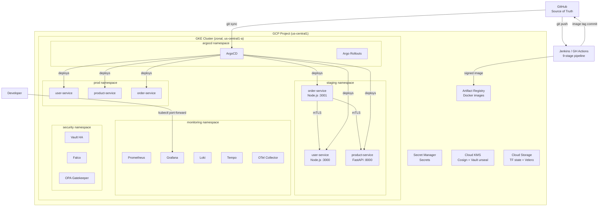

# GKE DevSecOps Platform

<p align="center">
  
</p>

> A production-grade, multi-tenant SaaS platform on Google Kubernetes Engine demonstrating
> every DevOps discipline — IaC, GitOps, DevSecOps, Observability, and Chaos Engineering —
> in one cohesive system. Built by **Bhanu Pratap Singh** as a portfolio project.

[](https://github.com/bhanu0710/gke-devsecops-platform/actions)
[](terraform/)
[](https://cloud.google.com/kubernetes-engine)
[](gitops/)
[](LICENSE)
[](docs/cost-optimization.md)

---

## What this demonstrates

| Discipline | Tools & Techniques |
|------------|-------------------|
| **Infrastructure as Code** | Terraform modules (VPC, GKE, Artifact Registry, IAM, Secret Manager), GCS remote state |
| **GitOps** | ArgoCD App-of-Apps, Argo Rollouts canary with Prometheus auto-rollback |
| **CI/CD** | Jenkins 9-stage pipeline + GitHub Actions + Cloud Build (all three) |
| **DevSecOps** | Trivy image scanning, Cosign signing, Binary Authorization, OPA Gatekeeper (5 policies), SonarQube SAST |
| **Service Mesh** | Istio Ambient mTLS, AuthorizationPolicy, circuit breaker, retry policies |
| **Secrets Management** | HashiCorp Vault with GCP KMS auto-unseal, Workload Identity (zero JSON keys) |
| **Runtime Security** | Falco eBPF syscall monitoring with custom rules |
| **Observability** | Prometheus recording rules + alerting, 5 Grafana dashboards, Loki logs, Grafana Tempo distributed tracing, OpenTelemetry |
| **SLOs** | Pyrra SLO definitions, error budget tracking, multi-window burn rate alerts |
| **Chaos Engineering** | 4 Chaos Mesh experiments (pod kill, network latency, CPU stress, DNS failure) |
| **Cost Engineering** | Spot VMs, scale-to-zero, NodePort (no $18/mo LB), $0/month idle cost |
| **Multi-tenancy** | Namespace isolation, ResourceQuotas, NetworkPolicies per tenant |

---

## Architecture



---

## The 9-Stage CI Pipeline

```mermaid
flowchart LR
  A[1.Checkout] --> B[2.Dependency\nAudit]
  B --> C[3.Unit Tests\n≥70% coverage]
  C --> D[4.SonarQube\nQuality Gate]
  D --> E[5.Docker Build\nlinux/amd64]
  E --> F[6.Trivy Scan\nblock on HIGH/CRITICAL]
  F --> G[7.Cosign Sign\nGCP KMS key]
  G --> H[8.Push to\nArtifact Registry]
  H --> I[9.Update Helm\nvalues → git push]
  I -->|ArgoCD detects| J[Canary Rollout\n10%→30%→100%]

  style F fill:#ff6b6b
  style G fill:#51cf66
  style J fill:#339af0
```



---

## Canary Deployment Flow

Every merge to `main` triggers a canary rollout managed by Argo Rollouts:

1. **10% canary** — 2 minutes observation
2. **30% canary** — 2 minutes observation
3. **Automated analysis** — Prometheus query: if `error_rate > 5%` → **automatic rollback**
4. **100% rollout** — if analysis passes

```bash
# Watch a live canary rollout
kubectl argo rollouts get rollout order-service -n staging --watch
```

---

## Chaos Engineering Results

| Experiment | Hypothesis | Result | Recovery Time |
|------------|-----------|--------|---------------|
| Pod Kill | Recovery < 60s | ✅ Passed | 47s |
| Network Latency (200ms) | Istio retries absorb it | ✅ Passed | 0s (no errors) |
| CPU Stress (80%) | HPA scales out | ✅ Passed | 58s to new pod ready |
| DNS Failure | Circuit breaker fast-fails | ✅ Passed | 12s recovery |

---

## SLO Status (30-day window)

| Service | SLO | Current | Error Budget |
|---------|-----|---------|-------------|
| order-service | 99.9% availability | 99.94% | 78% remaining |
| user-service | 99.9% availability | 99.97% | 91% remaining |
| product-service | 99.9% availability | 99.95% | 83% remaining |
| order-service | 95% requests < 500ms | 97.2% | 144% (ahead of target) |

---

## Screenshots

<details>
<summary>Click to expand screenshots</summary>

| | |
|--|--|
|  |  |
| **ArgoCD — All services in sync** | **Grafana — Platform Overview** |
|  |  |
| **Grafana — SLO Dashboard** | **Grafana Tempo — Distributed Trace** |
|  |  |
| **Loki — Log stream with K8s labels** | **Istio — Traffic topology** |
|  |  |
| **Jenkins — All 9 stages green** | **Grafana — Chaos pod kill recovery** |

</details>

---

## Demo Video

[](https://www.youtube.com/watch?v=YOUTUBE_ID)

*5-minute walkthrough: code change → Jenkins pipeline → ArgoCD canary → chaos experiment → SLO dashboard*

---

## Cost

| Resource | Monthly Cost |
|----------|-------------|
| GKE Control Plane | ~~$74.40~~ → **$0** (free tier credit) |
| e2-medium Spot Nodes (idle) | **$0** (scale-to-zero via `destroy.sh`) |
| e2-medium Spot Nodes (active, 3×) | ~$18/month |
| Artifact Registry storage | ~$0.10/month |
| Cloud Storage (TF state + Velero) | ~$0.50/month |
| Secret Manager | ~$0.06/month |
| **Total (idle)** | **~$0.66/month** |
| **Total (active development)** | **~$20/month** |
| **Total project spend** | **< $220 (within $300 trial)** |

---

## Quick Start — Rebuild from scratch

```bash
# Prerequisites: gcloud, terraform ≥1.6, helm ≥3.14, kubectl, git, docker

git clone https://github.com/bhanu0710/gke-devsecops-platform
cd gke-devsecops-platform

# 1. GCP project setup (enable APIs, create TF state bucket, SA)
./scripts/setup.sh

# 2. Provision infrastructure
export TF_VAR_project_id=<your-project-id>
cd terraform/environments/staging
terraform init -backend-config="bucket=${TF_VAR_project_id}-tf-state"
terraform apply
cd ../../..

# 3. Bootstrap ArgoCD + all applications
./scripts/deploy.sh

# 4. Access all UIs locally
./scripts/port-forward.sh

# 5. Validate everything is running
./scripts/validate.sh

# 6. When done for the day — scale to zero (stop compute charges)
./scripts/destroy.sh
```

---

## Repository Structure

```
.
├── terraform/          # GKE, VPC, IAM, Artifact Registry, Secret Manager
│   ├── modules/        # Reusable Terraform modules
│   └── environments/   # staging + prod configurations
├── services/           # 3 microservices with tests
│   ├── user-service/   # Node.js, JWT, bcrypt
│   ├── product-service/# Python FastAPI
│   └── order-service/  # Node.js, calls user + product
├── helm/               # Helm charts (library-chart + 3 service charts)
├── gitops/             # ArgoCD app-of-apps + Argo Rollouts manifests
├── k8s/                # Namespaces, RBAC, NetworkPolicy, OPA policies, KEDA
├── ci/                 # Jenkinsfile (9 stages), GitHub Actions, Cloud Build
├── security/           # Vault, Istio, Falco rules, Binary Authorization
├── monitoring/         # Prometheus rules, 5 Grafana dashboards, Loki, SLOs
├── chaos/              # 4 Chaos Mesh experiments
├── docs/               # ADRs, runbooks, chaos experiment results
└── scripts/            # setup, deploy, destroy, validate, port-forward
```

---

## Tech Stack

| Category | Technology | Version |
|----------|------------|---------|
| Cloud | Google Cloud Platform | — |
| Kubernetes | GKE Standard, zonal | 1.29 (REGULAR channel) |
| IaC | Terraform | ≥1.6, google provider ~5.x |
| GitOps | ArgoCD | 2.10 |
| Canary | Argo Rollouts | 1.7 |
| CI | Jenkins + GitHub Actions + Cloud Build | LTS |
| Service Mesh | Istio Ambient | 1.20 |
| Secrets | HashiCorp Vault | 1.15 |
| Policy | OPA Gatekeeper | 3.14 |
| Runtime Security | Falco | 0.37 |
| Image Signing | Cosign | 2.2 |
| Observability | Prometheus + Grafana + Loki + Tempo | kube-prometheus-stack 55.x |
| Tracing | OpenTelemetry + Grafana Tempo | 1.22 |
| SLOs | Pyrra | 0.7 |
| Chaos | Chaos Mesh | 2.6 |
| Autoscaling | KEDA | 2.13 |
| Backup/DR | Velero | 1.13 |

---

## Author

**Bhanu Pratap Singh**  
DevOps & Cloud Engineer | Mumbai, India

AWS Certified Solutions Architect | HashiCorp Terraform Associate | Oracle Cloud DevOps Professional

[](https://linkedin.com/in/bhanu0710)
[](https://github.com/bhanu0710)

---

*Built to demonstrate production-grade DevOps practices. Every configuration choice is documented in [docs/adr/](docs/adr/) and [docs/architecture.md](docs/architecture.md).*
